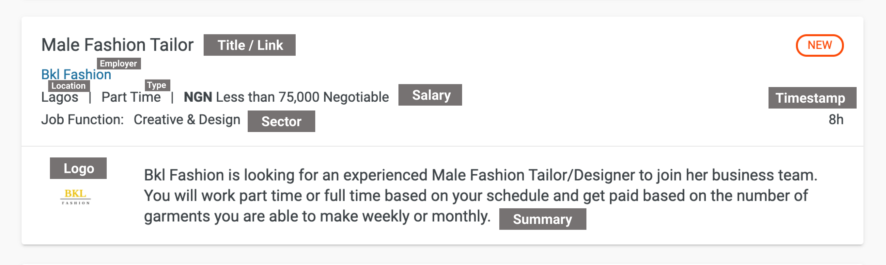

# Capstone Project (Python Basics)

Create an extensive job listings bot that focus on Jobberman. For this project, please note the following:

(1) Use a virtual environment to manage project dependencies.

(2) Create a python script to extract listings from project URL. If you need to do any transformation of data of any kind, it should be done in this script. Each job listing should be an object containing the following properties:
- title
- link
- employer
- location
- type
- pay
- task
- summary
- timestamp

(3) Handle and store the extracted data using only the CSV module.

(4) Create a main Python script to extract all job listings from page 1 to page N (specified as input) and finally store the data to a CSV file.

NOTE:
- Your project is expected to written using the OOP style as much as possible, following proper coding style guide (PEP8).
- Use Git & GitHub as your version control system VCS.

